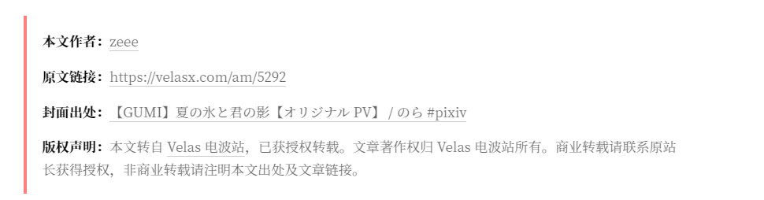

# Copyright for Typecho 自用版

这是一个 [Typecho](https://github.com/typecho/typecho) 插件，利用自定义字段功能灵活地在文章或独立页面尾部显示版权小尾巴。具体设置请看[原始文档说明](https://github.com/Yves-X/Copyright-for-Typecho)。

在原插件基础上增加了一个**封面图**的字符，修改了部分文字的显示效果。

| 字段 |类型|说明|示例|
|:---:|:---:|:----|:----|
|headpic|字符|封面出处|封面出处的链接|

在插件设置页此项设置处留空，或是把该字段的值设定为**整数0**来关闭它。
